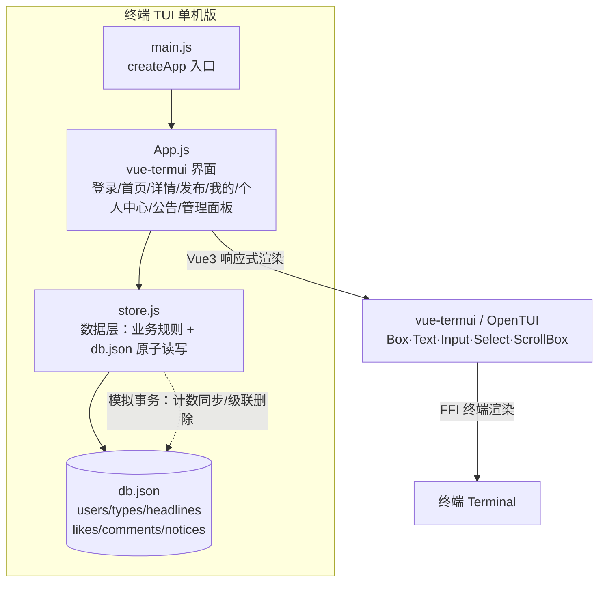
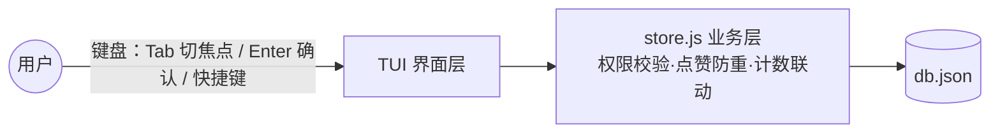

# 01 微头条 · 控制台单机版（终端 TUI / vue-termui）

基于 **Vue 3 + vue-termui 0.3（OpenTUI 渲染引擎）** 的终端 TUI 应用，数据以 `db.json` 单机持久化，无需服务端。

## 运行

vue-termui 0.3 依赖 FFI，需要 **Bun ≥ 1.3**（本机已通过 `npm i -g bun` 安装 1.4.2）：

```bash
bun install        # 首次
bun run start      # 或 bun run src/main.js
```

## 预置账号

| 用户名 | 密码 | 昵称 | 角色 |
|---|---|---|---|
| admin | 123456 | 系统管理员 | 管理员(role=1) |
| tom | 123456 | 汤姆 | 普通用户 |
| jerry | 123456 | 杰瑞 | 普通用户 |

## 操作说明

- **通用**：`Tab` 切换焦点（输入框/下拉/列表），`Enter` 确认选择或提交评论，`Ctrl+C` 退出
- **登录页**：输入用户名密码 → Tab 到「登 录」→ Enter；可切到「去注册」
- **首页**：搜索关键字、类型筛选、排序切换（Select 回车生效）；`Enter` 查看详情；快捷键：
  - `n` 发布头条 · `m` 我的头条 · `p` 个人中心 · `o` 公告
  - `a` 管理面板（仅管理员） · `[` `]` 翻页 · `g` 刷新 · `q` 退出
- **详情页**：`l` 点赞/取消点赞；评论框输入后回车发表；`r` 回复选中的评论；`d` 删除选中的评论（本人或管理员）；`Esc` 返回
- **我的头条**：`e` 修改（类型不可改）、`x` 删除（`y`/`n` 二次确认）
- **个人中心**：查看用户名/昵称/注册时间，修改密码（旧密码校验 + 两次一致）
- **管理面板**：用户列表、头条全量管理（改/删任何头条，删除 y/n 确认并级联）、类型管理（增/改/删，有关联禁止删）、公告管理（在公告页内增删）、热门排行（按赞/评/浏览排序+分页）、用户活跃排行、评论管理（筛选+删除含子评论级联）

## 说明

- 密码为明文演示（生产应使用 BCrypt）；单条点赞按 (用户,头条) 唯一约束
- `like_count` / `comment_count` 冗余计数在每次写操作中同步维护（模拟事务）
- 删除头条/评论时级联删除关联数据；密码输入以密文样式显示
- 数据文件：`db.json`（删除该文件可恢复种子数据）

## 项目构成（mermaid）




