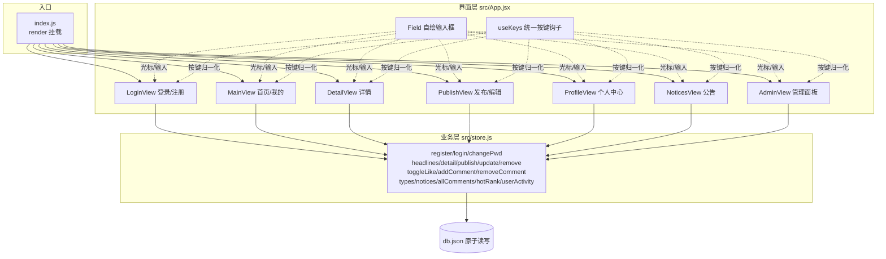

# 01-控制台单机版 · 文档索引

终端 TUI 单机版：**React 18 + Ink 5**（Bun 运行时），数据本地 `db.json` 持久化，无服务端。

| 文档 | 内容 |
|---|---|
| [原子功能与代码映射](./原子功能与代码映射.md) | 结构 → 原子功能 → 业务规则 → 实现代码位置 |
| [流程图](./流程图.md) | 全部原子功能流程的 mermaid 图 |
| [原子功能详解](原子功能详解-首页信息流.md) | 首页信息流：Field/useKeys/MainView 深度走读（参考 p/admin 原子化写法） |

## 架构总览



## 运行

```bash
npm install          # 或 bun install
bun run start        # bun src/index.js；账号 admin/123456
```
