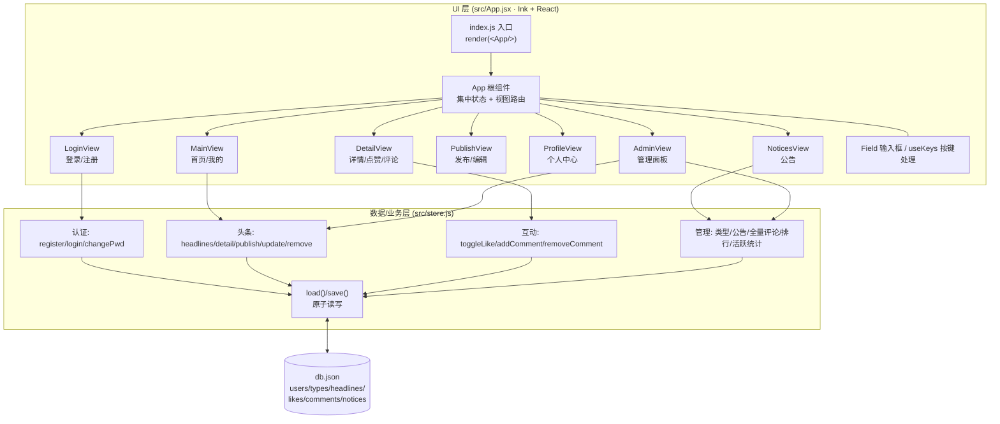

# 微头条 · 控制台单机版（Node 控制台版）架构总览

## 1. 项目定位

本项目是"微头条"系统的**终端 TUI 单机版**：在终端中以命令行界面完成登录、浏览、发布、点赞、评论、公告、管理等全部功能，数据以 JSON 文件本地持久化，无网络通信、无数据库服务。

## 2. 技术栈

| 类别 | 技术 | 说明 |
|---|---|---|
| 运行时 | Node.js（推荐 Bun） | `package.json` 中 `start: bun src/index.js`，ESM（`"type": "module"`） |
| UI 框架 | React 18（^18.3.1） | 仅作为状态与组件模型，不渲染 DOM |
| 终端渲染 | Ink 5（^5.2.0） | 用 React 组件语法渲染终端字符界面 |
| 持久化 | node:fs（readFileSync / writeFileSync / renameSync） | 单文件 `db.json`，临时文件 + rename 原子写入 |

## 3. 模块结构

```text
01-控制台单机版/
├── db.json            # 数据持久化文件（首次启动由 seed() 生成）
├── package.json       # 依赖：ink / react；脚本：bun src/index.js
└── src/
    ├── index.js       # 入口：render(<App />, { exitOnCtrlC: true })
    ├── App.jsx        # 全部 UI 层：视图组件 + 按键路由 + 全局状态
    └── store.js       # 全部业务/数据层：内存 db 对象 + db.json 读写
```

### 3.1 入口层 `src/index.js`

仅 6 行，用 Ink 的 `render` 挂载根组件 `App`，`Ctrl+C` 退出。

### 3.2 UI 层 `src/App.jsx`

- `App`（根组件，App.jsx:594）：集中式状态 `useState`，保存当前视图 `view`（login/register/main/mine/detail/publish/edit/profile/notices/admin）、当前输入焦点 `field`、列表索引、分页等；通过 `Views` 映射表切换视图。
- 各视图组件：
  - `LoginView`（App.jsx:74）— 登录/注册
  - `MainView`（App.jsx:122）— 首页信息流（同时复用为 `mine` 我的头条）
  - `DetailView`（App.jsx:228）— 头条详情 + 评论 + 点赞
  - `PublishView`（App.jsx:293）— 发布/编辑头条（同一组件复用）
  - `ProfileView`（App.jsx:339）— 个人中心/修改密码
  - `NoticesView`（App.jsx:385）— 公告查看/搜索/管理员发布删除
  - `AdminView`（App.jsx:443）— 管理面板（用户/头条/类型/排行/评论）
- 基础组件：`Field`（自绘光标输入框，App.jsx:28）、`Header`（App.jsx:57）、`Msg`（App.jsx:69）、`useKeys`（统一按键处理，App.jsx:16）。

### 3.3 数据/业务层 `src/store.js`

- 启动时 `load()` 读取 `db.json`，不存在或解析失败则使用内置种子数据 `seed()`（store.js:8）。
- 全部业务以 `store` 对象的方法暴露：认证（register/login/changePwd）、头条查询与维护（headlines/detail/publish/update/remove）、点赞评论（toggleLike/addComment/removeComment）、管理员（类型/公告/全量评论/排行/活跃统计）。
- 每次写操作后调用 `save()`（store.js:52）：先写 `db.json.tmp` 再 `renameSync` 原子落盘。

## 4. 数据存储方式

单文件 JSON 持久化（`db.json`，路径由 store.js:6 计算），六大集合：

| 集合 | 字段 | 说明 |
|---|---|---|
| `users` | id, username, password(明文), nickname, role(0 普通/1 管理员), create_time | 用户 |
| `types` | id, name | 头条类型（科技/体育/娱乐/财经/教育…） |
| `headlines` | id, uid, author, title, content, typeId, view_count, like_count, comment_count, create_time, update_time | 微头条正文 |
| `likes` | id, hid, uid | 点赞关系（一人一条一记录） |
| `comments` | id, hid, uid, author, content, parent_cid(0 为顶级), create_time | 评论（parent_cid 支持两级回复） |
| `notices` | id, title, content, remark, create_time | 系统公告 |

冗余计数：`like_count` / `comment_count` / `view_count` 直接存于 headline 记录，写入时同步维护。ID 生成用 `nextId(arr) = max(id) + 1`（store.js:47）。

## 5. 架构图



## 6. 关键设计要点

1. **单进程、零依赖服务**：除 ink/react 外无任何第三方库，数据层直接用 `node:fs`。
2. **UI 与数据完全解耦**：App.jsx 只调用 `store.*` 方法，不直接碰 db.json；store.js 不依赖 React。
3. **原子写盘**：先写 `.tmp` 再 rename，避免写一半损坏 db.json。
4. **权限模型**：`role === 1` 为管理员；修改/删除头条与评论时校验"本人或管理员"（store.js:136、store.js:146、store.js:178）。
5. **级联删除**：删除头条时同时清掉其 likes 与 comments（store.js:148-149）；删除评论时递归删除子评论（store.js:180-185）。
6. **浏览量统计**：`store.detail(id)` 每次被调用即 `view_count++` 并落盘（store.js:111）。
