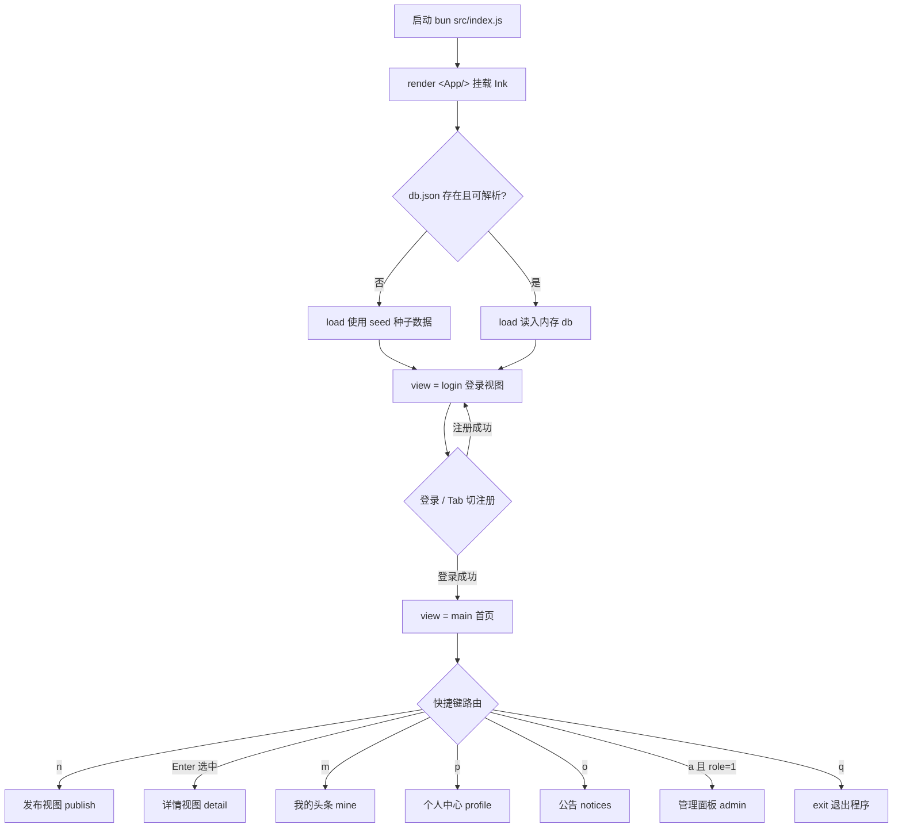
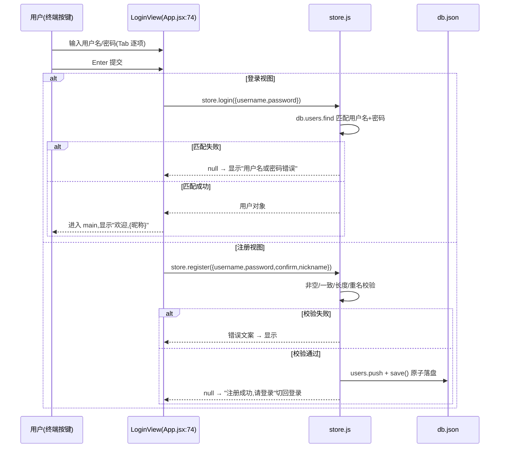
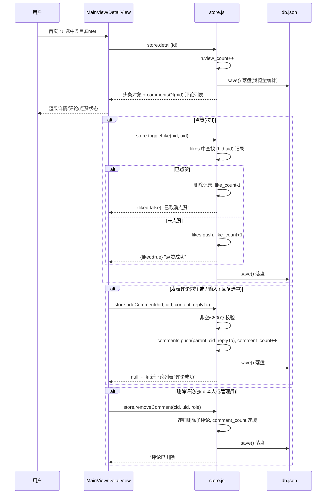
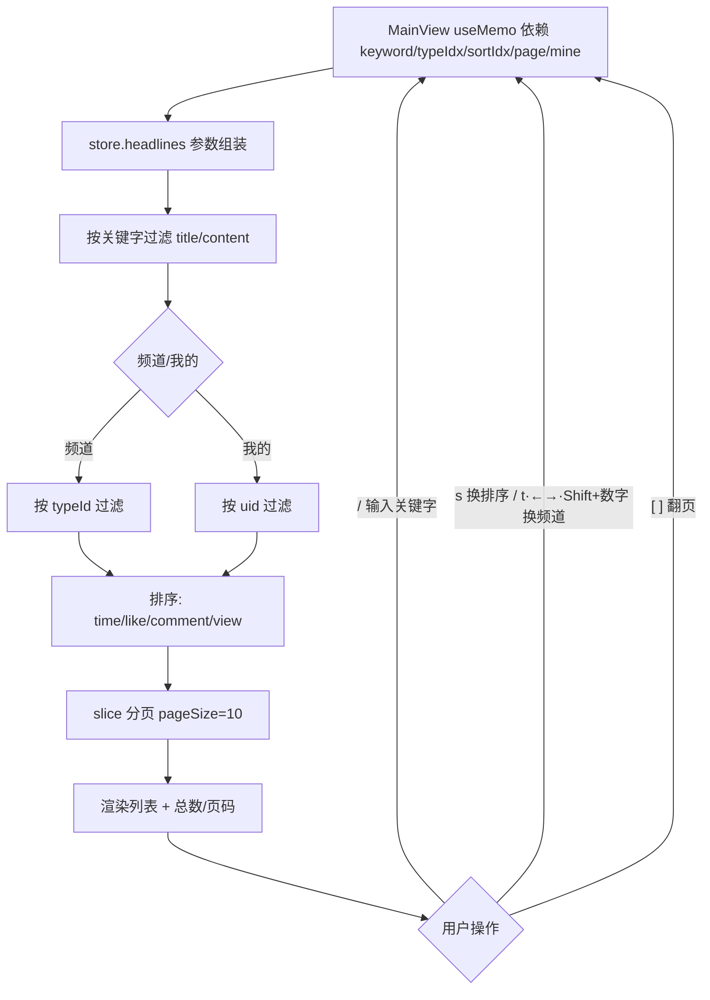
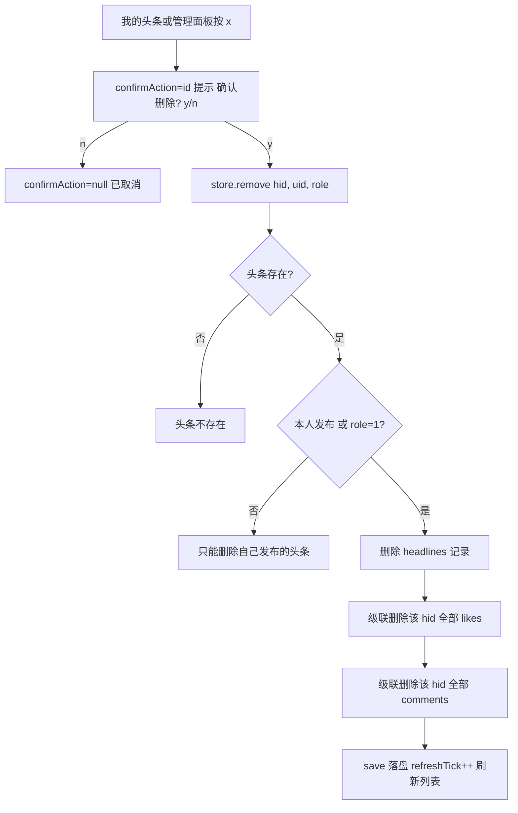
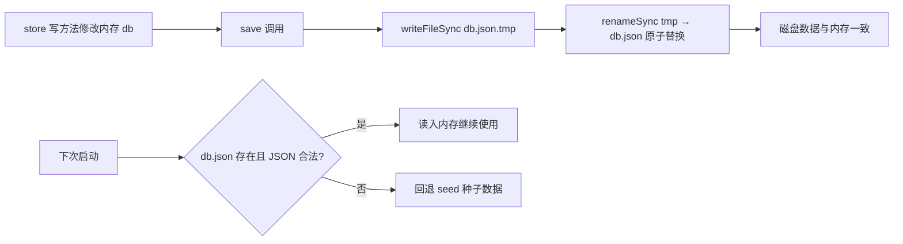

# 微头条 · 控制台单机版 业务流程图

> 依据真实代码绘制（`src/App.jsx`、`src/store.js`）。

## 1. 应用启动与整体导航



## 2. 登录 / 注册时序



## 3. 发布 / 编辑头条流程

```mermaid
flowchart TD
    A[首页按 n → publish 视图] --> B[填写标题 Tab 切换 填写内容 ←→ 选类型]
    B --> C{按 1 发布 / 编辑时按 1 保存}
    C -- 取消/Esc --> Z[返回 main / mine]
    C --> D{edit?}
    D -- 是 --> E[store.update hid,uid,role,数据]
    D -- 否 --> F[store.publish uid,数据]
    F --> F1{标题非空? 内容非空?≤5000字? 类型有效?}
    F1 -- 否 --> ERR[显示错误信息]
    F1 -- 是 --> F2[headlines.push 初始计数全 0]
    F2 --> S1[save 落盘 → "发布成功" 回首页]
    E --> E1{头条存在? 本人或管理员? 标题内容非空?}
    E1 -- 否 --> ERR2[显示错误信息]
    E1 -- 是 --> E2[更新 title/content/update_time 管理员可改 typeId]
    E2 --> S2[save 落盘 → "修改成功" 回我的]
```

## 4. 浏览详情 + 点赞 + 评论时序



## 5. 首页信息流查询流程



## 6. 删除头条流程（y/n 二次确认 + 级联删除）



## 7. 管理员面板流程

```mermaid
flowchart TD
    A[首页按 a 且 role=1] --> B[管理面板菜单 8 项]
    B -- 1 用户列表 --> C1[store.users 渲染用户表]
    B -- 2 头条全量管理 --> C2[store.headlines + e 改/x 删/t 类型// 关键字/[ ] 翻页]
    B -- 3 类型管理 --> C3[store.addType/updateType/removeType<br/>a 新增 r 改名 d 删除,有头条引用禁删]
    B -- 4 公告管理 --> C4[跳转 NoticesView: w 发布/x 删除]
    B -- 5 热门排行 --> C5[store.hotRank: s 切排序/[ ] 翻页]
    B -- 6 用户活跃排行 --> C6[store.userActivity 发布+评论数排序]
    B -- 7 评论管理 --> C7[store.allComments 关键字/头条ID 过滤,x 删除含子评论]
    B -- 8/Esc --> Z[返回首页]
    C2 -- Enter --> DT[复用 DetailView prevView=admin]
```

## 8. 数据持久化流程（所有写操作共用）


